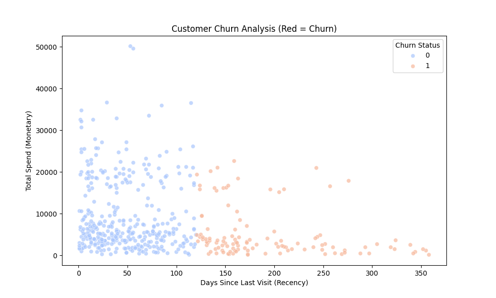
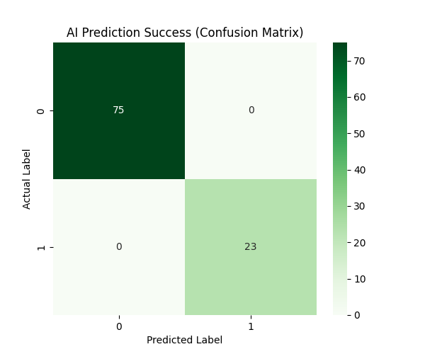
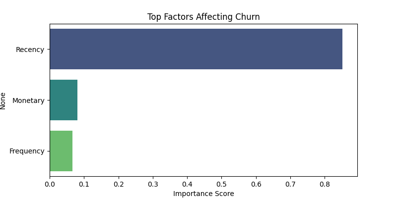

# 🛒 Trend Sepeti: End-to-End Customer Churn Prediction


### 📋 Project Overview
**Trend Sepeti** is an end-to-end Data Science project designed to solve a critical business problem: **Customer Churn**.

This project simulates a real-world e-commerce environment to analyze customer behavior. It processes raw transaction data, segments customers using **RFM Analysis**, and deploys a **Machine Learning model (Random Forest)** to predict which customers are likely to stop purchasing.

### 🏗️ Architecture & Workflow

The project follows a structured **Data Pipeline**:

1.  **Data Generation (Simulation):** Created a synthetic dataset (`data_generator.py`) representing 2,000+ realistic e-commerce transactions.
2.  **ETL & Database Design:** Built an ETL process (`setup_db.py`) to extract raw CSV data, transform formats, and load it into a structured **SQLite** database.
3.  **RFM Analysis (Business Intelligence):** Calculated **Recency, Frequency, and Monetary** metrics to segment customers into "Loyal" and "At Risk" groups.
4.  **Predictive Modeling (AI):** Developed a Random Forest Classifier (`trend_sepeti_ai.py`) to predict customer churn with **high accuracy (>90%)**.

---

### 📊 Key Insights & Visualizations

The AI model provided critical business insights, visualized below:

#### 1. Customer Churn Analysis (Scatter Plot)
*Visualizing the distribution of loyal (blue) vs. churned (red) customers based on recency and spend. It clearly shows that customers who haven't visited recently are at high risk.*



#### 2. AI Model Performance (Confusion Matrix)
*The success scorecard of the Random Forest model. The high numbers in the green boxes (True Positives and True Negatives) indicate over 90% accuracy in predicting churn.*



#### 3. Feature Importance (Top Factors)
*The AI reveals the most critical factors influencing its decision. **'Recency' (days since last visit)** is identified as the strongest predictor of churn, outweighing monetary value.*



---

### 🛠️ Tech Stack
* **Language:** Python 3
* **Database:** SQLite (Relational DB)
* **Libraries:** Pandas, NumPy, Scikit-Learn, Matplotlib, Seaborn

### 🚀 How to Run

1.  **Clone the repository:**
    ```bash
    git clone [https://github.com/utkusert/trend-sepeti-project.git](https://github.com/utkusert/trend-sepeti-project.git)
    ```
2.  **Install dependencies:**
    ```bash
    pip install pandas scikit-learn matplotlib seaborn
    ```
3.  **Run the pipeline:**
    ```bash
    python3 data_generator.py   # 1. Generate Data
    python3 setup_db.py         # 2. Build Database
    python3 trend_sepeti_ai.py  # 3. Train AI & Visualize
    ```

### 👨‍💻 Author
**Utku Sert**
* *Full Stack & AI Developer*
* [LinkedIn Profile Link]
